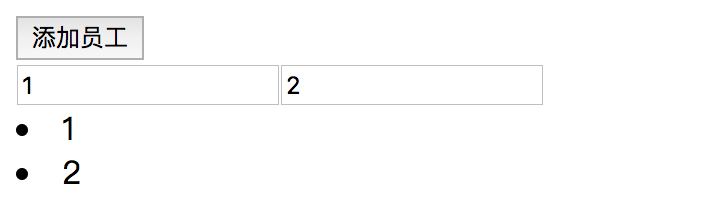
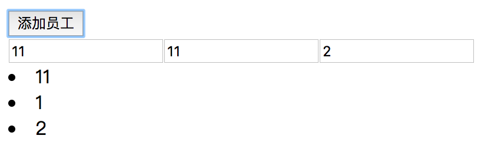

# 问题
一次项目需求中，需要将新增的订单行放在表格最上面。
其实需求很简单，只需要通过array.unshift或array.splice来插入数组元素即可。

实际项目的代码过于复杂，因此我重新写了个demo，代码如下。
```typescript
import { Component } from '@angular/core';

@Component({
  selector: 'app-root',
  template: `
    <button (click)="add()">添加员工</button>
    <form>
      <input *ngFor="let u of users; let i = index;" [name]="'input' +i" [(ngModel)]="u.name">
    </form>
    <li *ngFor="let u of users">{{u.name}}</li>
  `,
  styleUrls: ['./app.component.css']
})
export class AppComponent {
  users = [{ code: 1, name: 1 }, { code: 2, name: 2 }];
  index = 10;

  add(): void {
    this.index++;
    let user = { code: this.index, name: this.index };
    this.users.splice(0, 0, user); //界面错误
    // this.users.unshift(user);//界面错误
    // this.users.push(user); //后面追加，正确
  }
}
```
界面有一个按钮，负责添加用户，一个form用于修改数据，一个列表显示当前数组中的用户数据。

看起来一切顺利，直接运行，界面显示如下


点击添加按钮，结果不是我们期望的，而是如下图

> *其中input中显示的数据应该是：11、1、2*
> *查看下面显示的列表正确，说明js数组是正确的*

# 原因
angular会检测控件绑定的数据对象是否变化，如果没有变化将不刷新控件。
我们来模拟一次angualr的过程
- 首次打开界面
> angular通过ngFor构造了2个input控件，他们的name分别是input0和input1
- 点击添加按钮
> js数组最前面插入了一个元素  
> angular检测到users数组变化(由2个元素变成3个)，开始刷新input控件组
> 1. for循环第1个数组元素({code:11,name:11})，数据对象没有绑定控件，angular新建input并绑定，此input的name被设置为“input0”
> 2. for循环第2个数组元素({code:1,name:1})，数据对象已经绑定了input，并且name等于“input0”，angular接着判断input绑定的数据与数组数据一致（内存地址相同，元素属性相同），因此angular不会刷新界面的input控件  
> 3. for循环第3个数组元素({code:2,name:2})，与第2步相同，也不会刷新input控件  
**此时可以看到，界面有3个input控件，他们的name分别为input0、input0和input1。也就是第1个和第2个input的name相同了，这就解释为什么点击一次按钮后界面input显示数据为：11、11、2了**

> 理解了上面过程
>- 就知道如果再点一次添加按钮，界面input的值会变成 12、12、12、2
>- 还有为什么在数组最后push新元素不会出错了

# 解决方案
通过上面分析，我们知道了原因出在input的name属性上，那么我们只需要保证所有input的name属性唯一就可以了。比如将
```html
<input *ngFor="let u of users; let i = index;" [name]="'input' +i" [(ngModel)]="u.name">
```
改成
```html
<input *ngFor="let u of users; let i = index;" [name]="u.code" [(ngModel)]="u.name">
```
